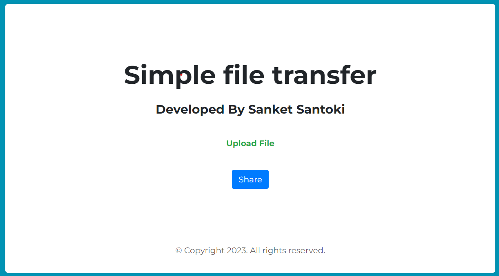
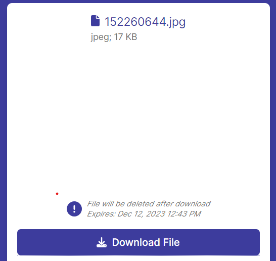

# CodeClauseInternship_File_Sharing_by_Link

# File Sharing App
Welcome to the File Sharing App repository! This project was developed as part of the CodeClause Internship Golden Project 1, showcasing a secure and efficient file sharing solution. The app is built using HTML, CSS, Bootstrap, and JavaScript, ensuring a seamless user experience.

File Sharing App Live Demo [link here](https://sanket-santoki.github.io/CodeClauseInternship_File_Sharing_by_Link/)

Github Profile [link](https://github.com/sanket-santoki/)

 

# Features
File Upload: Users can easily upload files of their choice.
Unique Shareable Links: The app generates unique links for each uploaded file, valid for 24 hours.
Automatic Deletion: Once the file is downloaded, it's automatically deleted for enhanced privacy.
Responsive Design: A clean and intuitive interface that adapts to various screen sizes.

# Contribution
Feel free to contribute, report issues, or suggest improvements. Your input is valued!

# Technologies Used:
HTML
CSS
Bootstrap
JavaScript

# Credits:
Developed by Sanket Santoki
Internship at CodeClause

Your feedback and contributions are highly appreciated. Thank you for checking out this project!

Happy Coding! 🚀
